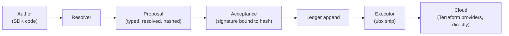

## The trust chain

Every change in `ubx`, written as an SDK program, moves through the
same fixed sequence before it can touch real infrastructure:

Four invariants hold at every step of this chain, and the rest of the
system's design is mostly downstream of enforcing them:

1. **What applies is exactly what was signed.** A hash match, never a
   file on disk.
2. **Every resource traces back.** `ubx why` on any live resource follows
   a real chain to the [proposal](/concepts/proposal) that created it,
   the intent behind it, and who approved it.
3. **The SDK never computes a value.** It operates in intent space only --
   the [resolver](/concepts/resolver) is the sole place a concrete value
   gets computed, and nothing an SDK program emits reaches apply without
   going through resolution and a human signature.
4. **Staleness is detected, not assumed away.** If live state or a
   pinned neighbor ledger moves after resolution, the proposal's hash no
   longer describes reality, and it must be re-resolved. See
   [Staleness](/concepts/staleness).

Markdown, diagram, and chat were also authoring frontends here, through
2026-08 (see the [Overview](/overview)'s own account of why they were
dropped) -- this diagram and the invariants above describe the SDK-only
system as it exists now, not a historical snapshot.

## How a change actually flows end to end

A hand-written SDK program compiles down to the same
[IR](/concepts/ir) before the resolver ever sees it. The resolver reads
live state, consults provider schema for exactly what it needs, and
produces a resolved delta deterministically (call it twice, require
byte-identical output). That delta becomes a proposal: hashed, and not
yet real until a signature — a PR merge or an explicit local
acceptance — binds to that exact hash. Only then does it join the
[ledger](/concepts/ledger), and only from the ledger can the executor
pick it up and ship it.

Nothing skips a step. A proposal that's accepted but never shipped is
just a permanent record; a proposal can't be shipped without having been
accepted; acceptance can't happen without a real, computed hash to sign.

## Execution layer: why tfplugin, directly

`ubx` runs no Terraform, OpenTofu, or Pulumi engine in the background. It
speaks the tfplugin gRPC protocol directly to Terraform provider
binaries — the same standalone, MPL-2.0 processes those tools themselves
talk to, cut out one layer earlier. `GetProviderSchema`, `ReadResource`,
`PlanResourceChange`, `ApplyResourceChange`, `ImportResourceState` — the
real provider surface, nothing routed through another tool's own state
model. There is no `.tfstate` file anywhere in this system; the ledger is
the only record that exists.

This wasn't a v6-only decision by design, it was corrected by evidence.
Scoped originally as tfplugin v6 only, real provider binaries — including
modern, terraform-plugin-framework-native ones, not just legacy SDKv2 —
were empirically found to serve v5 on the wire even when a client
explicitly requests v6. `ubx`'s provider layer exposes one
protocol-agnostic interface backed by two real wire implementations,
selected by whichever version the plugin actually negotiates during the
handshake — callers never branch on protocol version themselves.

## Failure semantics

The [executor](/concepts/executor) owns failure end to end: a
per-resource state machine (`pending` → `in_flight` → `applied`, with
`failed` and `unknown_post_timeout` as real, distinct outcomes),
reconciliation by querying the provider directly when a result is
ambiguous, and partial application modeled as real, inspectable state
rather than an all-or-nothing outcome. This is treated as the system's
reliability differentiator, not an edge case: adversarial failure paths
(provider timeout, partial state, an apply interrupted mid-flight) are
first-class, tested paths, not something bolted on after the happy path
worked.

Full detail: [`docs/architecture.md`](https://github.com/Ubiquex/ubiquex/blob/main/docs/architecture.md)'s
own "Trust chain" and "Execution layer" sections, and
[`docs/executor.md`](https://github.com/Ubiquex/ubiquex/blob/main/docs/executor.md)
for the complete state machine, in `ubiquex`.
