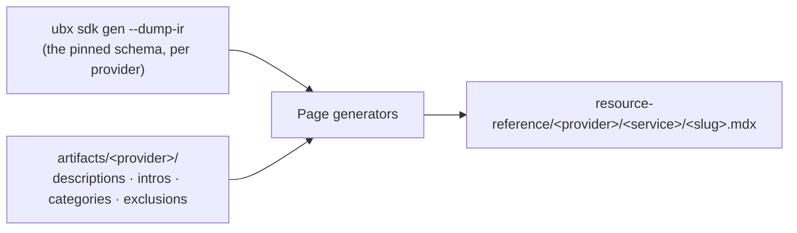

`ubiquex-docs` (docs.ubiquex.io) generates its resource-reference corpus
from two real inputs per provider: a schema dump and a set of hand- or
generator-authored artifacts. Neither one alone produces a page.

## The artifact model

Four real, per-provider JSON files, each answering a different question
a schema dump alone can't:

- **`descriptions.json`** — field-level prose, keyed by dotted path
  (`aws_access_analyzer_analyzer.analyzer_configuration...inclusions.account_ids`).
  Sourced from the vendor's own spec where it has one (`"source":
  "vendor-spec"`), authored by hand where it doesn't.
- **`intros.json`** — one real intro paragraph per wire type, the prose
  that opens a resource's page.
- **`categories.json`** — an `overrides` map from wire type to the real
  display label its nav group should use (`"AWS IAM Access Analyzer"`,
  `"Amazon MQ"`) — the authoritative source [SDK and codegen's own
  service-name derivation](/sdk-and-codegen) doesn't have to be, and
  isn't, since a service's real product name and its mechanically-derived
  package name aren't always the same string.
- **`exclusions.json`** — real, reasoned decisions to skip something
  (`skip_descriptions`, `skip_page`), each with a `reason` field
  explaining why, not a bare list of names. AWS's own QuickSight
  visualization schemas are excluded from field-description coverage
  this way: real, deeply-nested chart-configuration fields at a ~0.1%
  real sourced rate that nobody hand-authors, keyed under both of
  QuickSight's two real, differently-formatted wire names so the
  exclusion applies regardless of which schema source a future
  regeneration uses.

## Per-provider artifact migration (UBI-240 slice 5)

The four artifact files above are moving, one provider at a time, out
of `ubiquex-docs`' own `artifacts/<provider>/` and into that provider's
own `ubx-sdk-<provider>` repo — so a description-authoring change and
the bindings regen it should have accompanied land in the same commit,
against the same schema, instead of drifting across two repos the way
the original split did (the real 49,479-description gap
[UBI-102](https://linear.app/ubiquex/issue/UBI-102) closed once by
hand). Kubernetes is migrated first, smallest and already proven twice
through the new `ubx-docs-providers` site.

**A real finding that changed the shape of this migration**: the pin
UBI-102 built (`sdk/providers/.ubx/config`'s own
`[dynamic_providers.<name>.descriptions]` block, resolved via
`provider.AcquireDescriptions` against a namespaced `ubiquex-docs`
release) was never actually wired into the workflow that keeps a
provider's published SDK current. `hash-watch.yml` regenerates from its
own separate, schema-only scratch config and has never passed
`--descriptions-dir` — confirmed live for kubernetes, where the
currently published code does carry real AI-authored descriptions (an
exact text match against the corpus), but only from whatever
generation produced its own one commit, never refreshed since. The next
real schema drift would have silently regenerated without the corpus,
with nothing anywhere flagging the regression. See UBI-102's own
comment thread for the full account.

**For a migrated provider**: `artifacts/<provider>/{descriptions,
intros,categories,exclusions}.json` live in the SDK repo itself.
`export_raw_descriptions.py` (still here, still the one real
implementation of the qualifier-strip/HTML-unescape transform,
[UBI-222](https://linear.app/ubiquex/issue/UBI-222)'s own fix included)
gains `--descriptions-path`/`--nested-out` so an authoring session can
point it at a sibling `ubx-sdk-<provider>` checkout and write that
repo's own codegen-ready `<provider>.json` (the `{resource: {relPath:
text}}` shape `--descriptions-dir` reads) directly — committed
alongside `descriptions.json` in the same PR. `hash-watch.yml` then
passes `--descriptions-dir` at that already-checked-out local path: no
pin, no network fetch, no separate release, and — for the first time —
every real regen actually applies the corpus.

`artifacts/kubernetes/` and `descriptions-raw/kubernetes.json` are kept
in `ubiquex-docs` for now, deliberately not deleted alongside this
migration: 169 real, live `resource-reference/kubernetes/` pages and
this repo's own `coverage_check.py`/`regen_pages.py` still read them.
They're no longer the canonical source (the SDK repo's own copy is),
but removing them is a separate decision — retiring the Mintlify
kubernetes pages themselves — not a side effect of relocating where the
corpus is authored.

## The coverage check

A schema dump grows continuously — a vendor adds a resource, a field
gains a description upstream — and nothing about editing an artifact
file by hand notices that on its own. `coverage_check.py` closes that
gap: for every real wire type in a fresh dump, it checks the artifacts
above and the real, on-disk page tree, and reports exactly five real
gap categories — missing intro, missing category, missing field
description (for a depth-0 field the vendor spec didn't describe
either), a schema entry with no page, and a page with no matching
schema entry. `ubiquex-docs`'s own `coverage-watch.yml` runs this
weekly and opens or updates one standing issue when it finds something,
the same "surface, never silently fix" shape this site's own
[`sync-drift-watch`](https://github.com/Ubiquex/ubiquex-internals/blob/main/.github/workflows/sync-drift-watch.yml)
is modeled on.

### A coverage gap never deletes a real page (UBI-234)

`stage_gap_free.py`, the step that keeps a gapped resource out of the
batch it writes, used to treat a coverage miss as grounds to remove
the file it had just overwritten — including a wire that already had a
real, previously-published page before this run touched it. Two real
incidents (401 pages, then 214) both destroyed genuinely good,
already-live content this way, and both times the coverage result
itself turned out to be wrong for a run-specific reason (a stale
checkout racing a same-initiative follow-up commit; a live schema
fetch's own name-collision disambiguation landing differently between
runs), not because the content was actually bad.

The fix is structural, not "check more carefully." An artifact-coverage
miss (missing intro, category, or field description) now only ever
withholds this run's own fresh draft. If the wire already had a page
at `HEAD`, that page is restored to exactly what was already published
(`git checkout HEAD`, discarding this run's own draft for it) instead
of removed — a wire with no prior page has nothing to lose, so it is
simply never written, same as before. The gap keeps getting reported
in the run's own step summary and PR body either way, for a human to
close.

The other real removal signal — a page whose wire no longer matches
ANY schema entry at all, a genuine upstream rename or removal — never
triggers a delete either. It's recorded the first time it's seen in a
real, checked-in `artifacts/<provider>/removal_candidates.json`, and
only reported as ready for a human to actually remove once the SAME
wire shows up orphaned again on a SEPARATE run (a different CI run id,
never a second check within the one run that first saw it). A
transient orphan — this run's own fetch was incomplete, a collision
suffix landed differently — self-heals out of the candidates file the
next time that wire matches again, rather than lingering or ever
triggering an automatic delete on its own.

## Provenance enforcement — what actually closed UBI-197

A generation can be internally clean and still be wrong, and the real
incident behind this project's provenance discipline is exactly that
shape. The corpus that shipped under UBI-197 was built from a real,
unmerged `ubx-provider-dynamic` branch that existed locally for under an
hour, with nothing recording that it had ever been used — a tool
checkout being dirty is invisible to a generator that only reads its
own output.

`ubx sdk gen` now writes a real `PROVENANCE.json` — source, commit,
dirty, unpushed — as a sibling of every real `--dump-ir` output
directory and every `--out` repo directory it produces.
`--require-clean-provenance` refuses to proceed if that record shows
anything but a clean, pushed commit. `ubiquex-docs`'s own
`provenance_check.py` reads those same records back before trusting a
batch, and catches a second, real, distinct failure mode a single
record can't: resource-page and data-source-page generation each need
two separate `ubx sdk gen` invocations (one `--dump-ir`, one `--lang go
--out`, run as separate processes) — if those land on two different
commits, each `PROVENANCE.json` is individually clean, but the corpus
the two runs jointly produce isn't coherent. Checking that every real
record found across a batch agrees on one commit catches that, not just
whether any single one was dirty.

What actually closed UBI-197, specifically: this same mechanism
extended to also stamp `schema_pinned`/`schema_source`/`schema_version`
(or `schema_url` when live) per provider, because a tool checkout being
clean says nothing about whether the *schema* it fetched was pinned or
still live-fetched. UBI-197's own root cause was Azure's real upstream
spec moving between two `ubx sdk gen` invocations run minutes apart,
against a genuinely clean tool commit both times — the schema itself had
drifted underneath a pass that looked, by every check that existed
before this fix, entirely clean. `provenance_check.py` now refuses on an
unpinned or missing schema stamp the same way it already refused on a
dirty tool checkout, and a record written before this fix — which has no
`schema_pinned` key at all — reads as unknown, deliberately, never as
implicitly pinned.

Full detail: [`docs/sdk.md`](https://github.com/Ubiquex/ubiquex/blob/main/docs/sdk.md)
for `ubx sdk gen`'s own side of provenance; `ubiquex-docs`'s own
[`scripts/resource-reference-gen/provenance_check.py`](https://github.com/Ubiquex/ubiquex-docs/blob/main/scripts/resource-reference-gen/provenance_check.py)
and [`coverage_check.py`](https://github.com/Ubiquex/ubiquex-docs/blob/main/scripts/resource-reference-gen/coverage_check.py)
for the consuming side.
