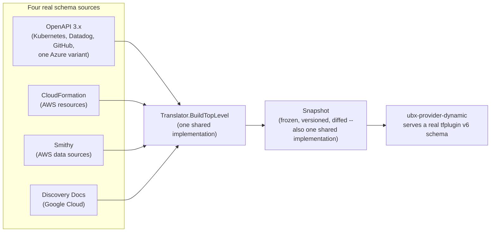

`ubx-provider-dynamic` is what makes the [execution layer](/architecture)
work without a hand-maintained schema for every real cloud API: a
tfplugin v6 binary that derives its own resource and data-source schema
at runtime from a real upstream spec, rather than shipping a
hand-written schema per provider the way a conventional Terraform
provider does.

## Four real sources, one translated form

Four schema sources exist today, each with its own real parser:

Each source's own package (`internal/openapi`, `internal/cloudformation`,
`internal/smithy`, `internal/discoverydoc`) has real, source-specific
fetch and parse logic — a CloudFormation registry zip fetch looks
nothing like an OpenAPI 3 document walk. But every one of them converges
on the identical translated form (`map[string]*tfprotov6.Schema`, built
by the one shared `Translator.BuildTopLevel`) before anything downstream
ever sees it.

## Why snapshots are taken after translation, not before

This convergence point is deliberate, and it's what let snapshotting
(freezing a schema version, diffing it against the prior one, publishing
it as a real, pinned artifact) be built once instead of four times. A
snapshot doesn't need to know or care whether the schema it's freezing
came from an OpenAPI spec or a CloudFormation registry — by the time it
sees the schema, that distinction is already gone. Diffing, versioning,
and reparse-verification are all real code that would otherwise have had
to exist once per source; instead there's one `Snapshot` implementation
and four thin `Generate<Source>Member` adapters that each do their own
native fetch, then hand the result to the shared core.

## The identity map: what a snapshot knows that a schema cannot say

A schema describes a resource's attributes. It does not say which of them
identify one instance, and the wire protocol has no field for it: an
attribute can be marked required, optional, computed or sensitive, and
none of those mean "this is how you find the resource again".

That worked for Terraform-shaped providers, where the convention is an
attribute literally named `id`, and failed badly everywhere else. A
CloudFormation resource's identifier is read-only, therefore computed,
therefore excluded by exactly the derivation that looks for required
attributes. Ten percent of AWS resource types ended up with no lookup key
at all and another fifty-three percent with one that could not re-find
the resource. Those could not be destroyed through ubx and were never
drift-checked.

So the snapshot publishes the answer alongside the schema, as a third
file: resource type to the attributes that identify one instance,
computed once at generation time from whichever source format that
provider used. It is the same convergence argument as the rest of this
page. The knowledge exists natively in each source, in a different shape
each time, and the translation step is the only place that can normalize
it.

Publishing none is legal and means "this snapshot cannot say", which is
distinct from "this type has no identity" and must stay distinct in every
consumer. Providers ubx does not ship schemas for have no map at all.

Two things read it, and for a while only one did. The apply path uses it
to derive the lookup key to **record** after a create succeeds. The scan
path uses it to tell a human which attributes to **supply** when they
have to identify a resource by hand, for instance when adopting something
that already exists. The second consumer was missing for long enough to
matter: ubx would work out that a queue is identified by its URL, write
that down, and then answer "check the provider schema for its required
lookup fields" to someone who needed the same answer a moment later. The
gap was never the data. It was that the one moment a person needs it was
the one moment nothing consulted it.

## Per-member clients, and why a "group" isn't one client

A single real provider a user pins against — "kubernetes," "aws" — isn't
always backed by one fetch. AWS's real resources come from CloudFormation
(one member); AWS's real data sources come from Smithy, and Smithy's own
API surface is naturally split across roughly 430 individual per-service
models, not one monolithic spec. Kubernetes' resource-mode and
data-source-mode schemas are two separately-fetched members of the same
real provider too. Each of these is a **member**: its own fetch, its own
parser, its own translated schema — merged together into one real,
coherent provider only at the group level, so a user pins and acquires
"aws" once, never "aws" and "aws\_data" separately just because the
implementation happened to fetch them differently.

## The mixed-source dispatch layer

Most groups are single-source: every member came from the same schema
source, and a fast path (`GroupSchemaSource`) handles them without
needing to reason about more than one source at all. AWS is the one real
exception in this org — its resources and data sources come from two
genuinely different sources (CloudFormation and Smithy) inside the same
group. `SubsetBySource` and the mixed-source fallback path exist
specifically for this: when a group's members don't all share one
source, dispatch falls back to handling each real source's own subset
independently, then merges the results (with an explicit, recorded
precedence for any real name collision across sources — the same
mechanism that decides, e.g., which of two real Datadog v1/v2 wire types
wins when both exist).

This mattered more than it might look, because not every real code path
that needed to reason about a group's schema source got the mixed-source
fallback at the same time. `--dump-namespaces` — the mechanism [SDK and
codegen](/sdk-and-codegen) depends on to place an AWS resource under its
real service name — called the single-source fast path directly and had
no fallback at all, because AWS was the only real mixed-source group in
this org and its own path through `--dump-namespaces` had never actually
been exercised against a real mixed group before it was pinned. The
practical consequence: AWS's real namespace lookup failed outright,
silently, for the whole provider, and every AWS resource's generated
package name fell back to a plain mechanical guess instead. See [SDK and
codegen](/sdk-and-codegen) for what that fallback actually produces and
how widely it was wrong.

## Pinned config: a schema is acquired, never assumed current

`ubiquex` never live-fetches a provider's schema by default anymore.
`sdk/providers/.ubx/config`'s `[providers.<name>]` table pins a specific,
versioned snapshot per provider — a real GitHub Release in that
provider's own `ubx-schema-<name>` repo, acquired via `AcquireSchema`,
never inferred from whatever happens to be checked out locally. This is
what makes `ubx sdk gen` reproducible: the same pin produces the same
generated output regardless of what's changed upstream since, and
bumping the pin is a real, visible, committed config change, not a
silent drift. `[dynamic_providers.<name>]` is the older, still-real
live-fetch shape, kept for any provider that doesn't have a published
snapshot yet — not a second, permanent way of doing the same thing, a
staging state on the way to being pinned.

## Adding a new source

A fifth schema source would need its own fetch/parse package and its own
thin `Generate<Source>Member`/`Load<Source>Member` pair — the same shape
every one of the four real ones already has — but nothing about the
shared `Translator`, the `Snapshot` core, or the mixed-source dispatch
layer, since all of that already operates on the converged form, not on
any one source's own native shape.

Full detail: `ubx-provider-dynamic`'s own `internal/snapshot` package,
and `ubiquex`'s [`docs/sdk.md`](https://github.com/Ubiquex/ubiquex/blob/main/docs/sdk.md)
for the acquisition and pinning side.
