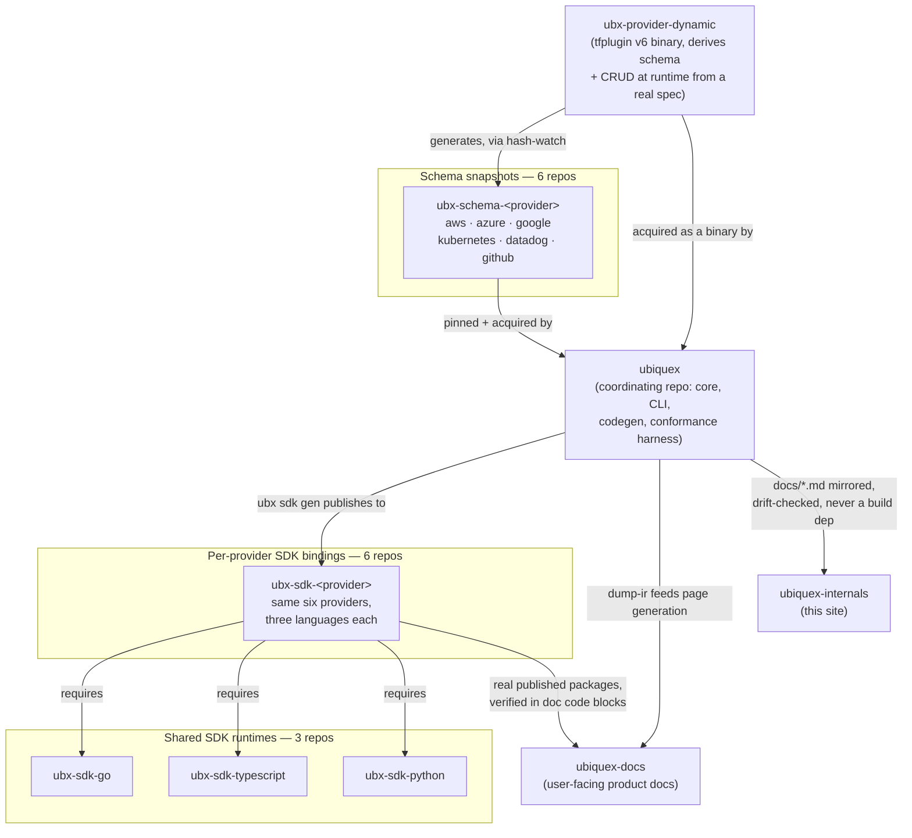

The `Ubiquex` org has more repos than the system this site describes.
Some are the legacy `ubx` v1 (XCL language) project, archived and
unrelated to anything below — `xcl`, `tree-sitter-xcl`,
`ubx-plugin-terraform`, and their siblings. A few more are real but
peripheral: `ubiquex-web` and `ubiquex.io` are the marketing site, not
the product; `ubx-providers-check-demo` and `ubx-sdk-blueprints` are
real, working demo/example repos that exercise a mechanism (provider
version-watch automation; a git-distributed blueprint) rather than being
depended on by anything. None of those four appear in the diagram below.

What's left is 22 repos that form one real dependency graph, and the
point of this page is that graph, not an inventory. Each tier below
exists because something upstream of it needs it to exist.

## The graph

## Reading it

**`ubx-provider-dynamic`** sits at the root. It's a standalone tfplugin
v6 binary that derives its own schema and CRUD behavior at runtime from
a real upstream spec (OpenAPI, CloudFormation, Smithy, or a Discovery
Doc, depending on provider). It doesn't depend on anything else in this
graph — everything else either consumes its binary directly or consumes
a schema snapshot generated from it.

**The six `ubx-schema-<provider>` repos** are frozen, versioned schema
snapshots — the output of running `ubx-provider-dynamic` against a real
upstream spec once and committing the result, rather than every
`ubiquex` session live-fetching that spec on every run. `ubiquex` pins a
specific version of each via `[providers.<name>]` in
`sdk/providers/.ubx/config` and acquires it through a real GitHub
Release, never inferring "current" from the monorepo's own state.

**`ubiquex`** is the coordinating repo — not because it's more important
than the others, but because it's the one place that has to know about
all of them: it acquires the dynamic provider binary and the schema
snapshots, generates the per-provider SDK bindings from what it learns,
and feeds both docs sites.

**The three shared runtimes** (`ubx-sdk-go`, `ubx-sdk-typescript`,
`ubx-sdk-python`) are real published packages — the Go module proxy, npm,
PyPI — that every one of the six bindings repos depends on the way any
real package depends on a library, not a convention.

**The six `ubx-sdk-<provider>` repos** are what `ubx sdk gen` actually
publishes: typed bindings in three languages per provider, generated
from whatever `ubiquex` currently knows about that provider's schema.
This is also where `ubiquex-docs` closes the loop — every code example
on a resource-reference page is verified against these repos' own real,
published packages, not a freshly generated local copy, so a page that
validates today is verified against what a reader could actually
install.

**`ubiquex-docs` and `ubiquex-internals`** are the two documentation
sites, and they relate to `ubiquex` differently on purpose. `ubiquex-docs`
has a real generation pipeline — `dump-ir` output plus the bindings
repos' own published packages feed real page content. `ubiquex-internals`
(this site) has no generation pipeline at all: it mirrors
`docs/architecture.md`, `docs/schema.md`, and friends as distilled prose,
tracked in `sync-state.json`, flagged by `sync-drift-watch` when the
source moves — a content relationship, never a build dependency.

Full detail on any one piece: `ubiquex`'s own
[`docs/source-tree.md`](https://github.com/Ubiquex/ubiquex/blob/main/docs/source-tree.md)
covers package layout within the coordinating repo itself; this page is
the map across repos, not within one.
